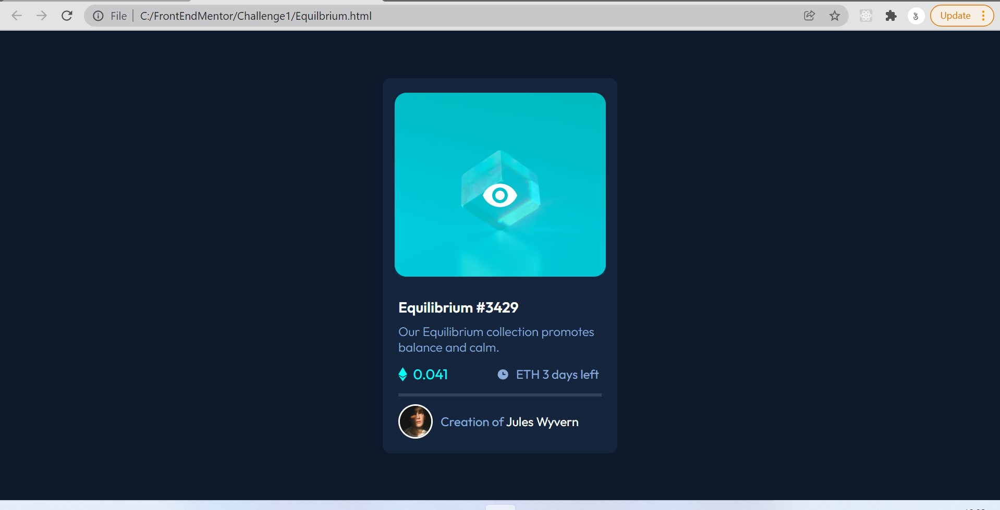
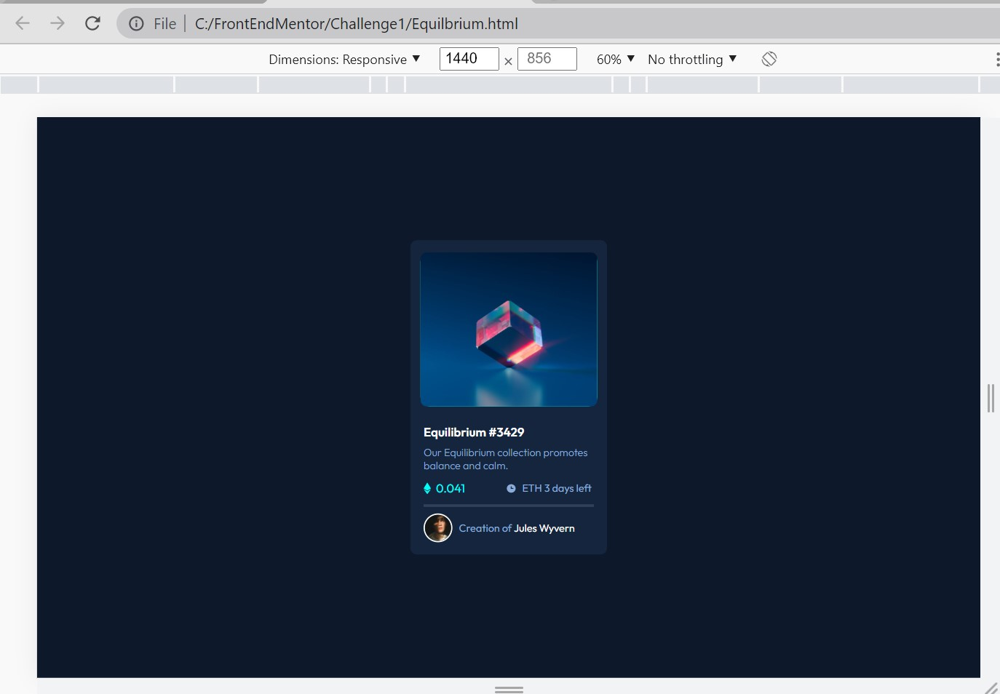

# frontendmentorChallenge2
Frontend Mentor | NFT preview card component

## Table of contents

- [Overview](#overview)
  - [The challenge](#the-challenge)
  - [Screenshot](#screenshot)
  - [Links](#links)
- [My process](#my-process)
 <!-- - [Built with](#built-with)
  - [What I learned](#what-i-learned)
  - [Continued development](#continued-development)
  - [Useful resources](#useful-resources)-->
- [Author](#author)
<!-- - [Acknowledgments](#acknowledgments)-->

## Overview

### The challenge

Users should be able to:

- View the optimal layout depending on their device's screen size
- See hover states for interactive elements

### Screenshot

### Links

- Solution URL: [Add solution URL here](https://github.com/krtksharma/frontendmentorChallenge2)
- Live Site URL: [Add live site URL here](https://krtksharma.github.io/frontendmentorChallenge2/)

## My process

### Built with

- Semantic HTML5 markup
- CSS custom properties
- Flexbox

## Author

- Frontend Mentor - [@krtksharma](https://www.frontendmentor.io/profile/krtksharma)
